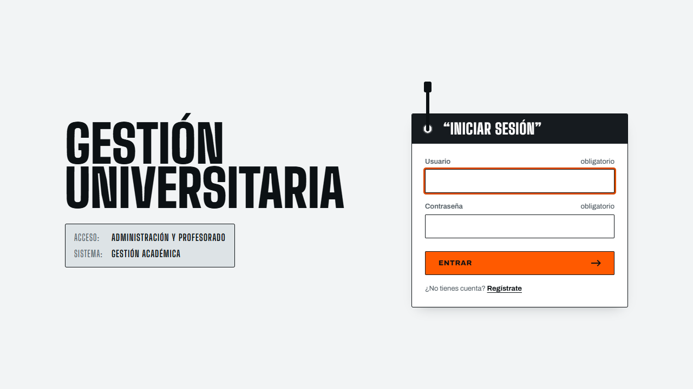
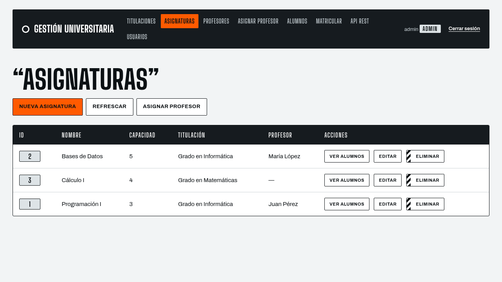

# Gestión Universitaria

[](https://github.com/gguillex/Gestion-Universitaria/actions/workflows/ci.yml)

Aplicación web para gestionar **titulaciones, asignaturas, profesorado, alumnado y matrículas**, con control de plazas, roles de usuario y exportación de listados. Está construida con Jakarta EE y JSP, siguiendo el patrón **Front Controller**, sin frameworks.



## Qué puede hacer

- **Acceso y cuentas:** inicio de sesión, autorregistro y roles `admin` y `usuario`. Solo el administrador gestiona usuarios.
- **Catálogo académico:** alta, edición y baja de titulaciones, asignaturas, profesores y alumnos, y asignación de profesor a cada asignatura.
- **Matrículas:** matricular y desmatricular respetando la capacidad máxima de cada asignatura.
- **Listados:** alumnos matriculados por asignatura con indicador de plazas y **exportación a CSV**.
- **Reglas de negocio:** no se puede eliminar una asignatura con alumnos matriculados ni bajar su capacidad por debajo de los ya matriculados.



## Tecnología

| Capa | Tecnología |
|---|---|
| Lenguaje y plataforma | Java 17, Jakarta EE (Servlet 6, JSP 4, JSTL 3) |
| Servidor | Apache Tomcat 11 |
| Base de datos | MySQL 8 o MariaDB, con un pool JNDI |
| Acceso a datos | JDBC con `PreparedStatement` |
| Construcción | Maven (con Maven Wrapper) |
| Pruebas | JUnit 5 y Mockito |

## Puesta en marcha

Requisitos: **JDK 17 o superior**, **Tomcat 11** y **MySQL o MariaDB** (por ejemplo con XAMPP).

1. **Crear la base de datos** y cargar los datos de ejemplo:

   ```bash
   mysql -u root < db/gestion_universitaria.sql
   ```

2. **Revisar la conexión** en [`src/main/webapp/META-INF/context.xml`](src/main/webapp/META-INF/context.xml). Por defecto usa `root` sin contraseña, como una instalación local de XAMPP.

3. **Construir el WAR:**

   ```bash
   ./mvnw package        # en Windows: mvnw.cmd package
   ```

4. **Desplegarlo:** copiar `target/GestionUniversitaria.war` a la carpeta `webapps/` de Tomcat y abrir  
   <http://localhost:8080/GestionUniversitaria/>.

**Acceso de ejemplo:** usuario `admin`, contraseña `admin`. Cámbiala en cuanto entres (*Usuarios → Editar*).

> **Uso en producción:** este proyecto está pensado para aprender y demostrar la arquitectura. Antes de exponerlo, cambia las credenciales de ejemplo, configura una contraseña para el usuario de la base de datos y sirve la aplicación por HTTPS.

## Pruebas

```bash
./mvnw test
```

26 pruebas automáticas sobre las reglas de negocio principales (login, control de acceso por rol, capacidad de las asignaturas y matrículas). No necesitan base de datos: las peticiones y los DAO se simulan con Mockito.

## Seguridad

- Contraseñas con **PBKDF2-HMAC-SHA256** (210.000 iteraciones y sal aleatoria); las contraseñas en texto plano heredadas se convierten a hash en su primer acceso.
- **Protección CSRF** con un token por sesión en todos los formularios; las acciones que modifican datos solo aceptan `POST`.
- Cambio de identificador de sesión al iniciar sesión, **límite de intentos** de acceso (5 por usuario y 20 por dirección IP cada 15 minutos) y revalidación del usuario y su rol en cada petición.
- Consultas siempre con `PreparedStatement` y salida escapada con `<c:out>` en las vistas.

## Documentación

| Documento | Contenido |
|---|---|
| [Arquitectura](docs/arquitectura.md) | Flujo de una petición, paquetes, acciones, seguridad y modelo de datos |
| [Guía de desarrollo](docs/guia-de-desarrollo.md) | Cómo ejecutar, probar y ampliar la aplicación |
| [Sistema de diseño](docs/diseno.md) | Colores, tipografía, componentes y reglas de accesibilidad |
| [Producto](docs/producto.md) | Usuarios, objetivos y principios del producto |

## Estructura

```
.
├── db/                       Script SQL: esquema y datos de ejemplo
├── docs/                     Documentación
├── src/
│   ├── main/
│   │   ├── java/gestion/     Código: filtro, controlador, acciones, modelo (DAO) y utilidades
│   │   └── webapp/           Vistas JSP, hoja de estilos, fuentes y configuración de Tomcat
│   └── test/java/gestion/    Pruebas automáticas
├── pom.xml
└── mvnw, mvnw.cmd            Maven Wrapper: no hace falta instalar Maven
```

## Licencia

Código bajo licencia [MIT](LICENSE). Las fuentes incluidas (Archivo y Big Shoulders Display) se distribuyen con su propia licencia SIL Open Font License; ver [`src/main/webapp/css/fonts/`](src/main/webapp/css/fonts/).
