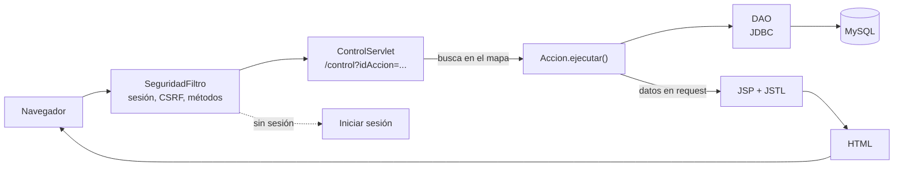
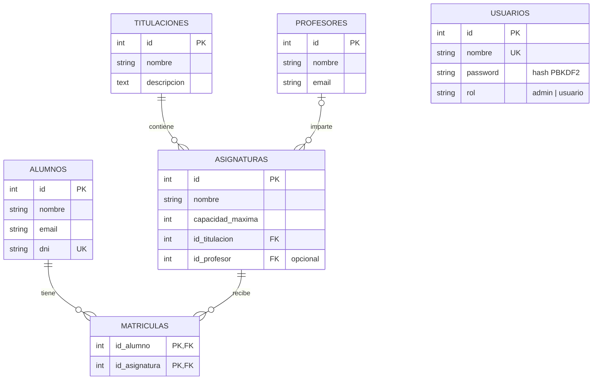

# Arquitectura

La aplicación sigue el patrón **Front Controller**: todas las peticiones pasan por un filtro de seguridad y por un único servlet que delega en una clase de acción por operación. Las vistas solo presentan datos.

Además de esta interfaz web, la aplicación expone una **API REST** (`/rest/*`, atendida por Jersey) sobre los mismos DAO, con el mismo filtro de seguridad. Está descrita en [rest.md](rest.md), y la comparación entre las dos interfaces en [mvc-y-rest.md](mvc-y-rest.md).

## Flujo de una petición

1. El **filtro** intercepta todas las peticiones. Sin sesión activa solo deja pasar el inicio de sesión, el registro y los recursos de `/css/`.
2. El **controlador** lee el parámetro `idAccion`, busca la acción en un `Map<String, Accion>` y la ejecuta. Nunca accede a la base de datos.
3. La **acción** contiene la lógica de negocio: valida, llama a los DAO, deja los datos en la petición o la sesión y devuelve la ruta del JSP, o `null` si ya ha redirigido.
4. El **JSP** genera el HTML. No contiene código Java: solo JSTL y expresiones EL.

## Paquetes

| Paquete | Responsabilidad |
|---|---|
| `gestion.filtro` | `SeguridadFiltro`: sesión, token CSRF, métodos permitidos y revalidación del usuario |
| `gestion.controlador` | `ControlServlet`: único punto de entrada (`/control`) |
| `gestion.accion` | Interfaz `Accion` y una clase por operación, agrupadas por entidad |
| `gestion.modelo` | `ConexionBD` (pool JNDI) y un DAO por entidad. Solo SQL y JDBC, sin lógica de negocio |
| `gestion.bean` | Clases de datos: `Titulacion`, `Asignatura`, `Profesor`, `Alumno`, `Usuario` |
| `gestion.util` | `Passwords` (hash PBKDF2) y `LimitadorIntentos` |
| `gestion.rest` | Servicio REST: `controller`, `service`, `exception` y `util`. Ver [rest.md](rest.md) |

Las vistas están en `src/main/webapp/WEB-INF/vistas/`, protegidas dentro de `WEB-INF`: solo se llega a ellas a través del controlador.

## Acciones disponibles

| Área | `idAccion` |
|---|---|
| Sesión | `mostrarLogin`, `login`, `logout`, `mostrarRegistro`, `registro` |
| Titulaciones | `listarTitulaciones`, `formTitulacion`, `guardarTitulacion`, `eliminarTitulacion` |
| Asignaturas | `listarAsignaturas`, `formAsignatura`, `guardarAsignatura`, `eliminarAsignatura` |
| Profesores | `listarProfesores`, `formProfesor`, `guardarProfesor`, `eliminarProfesor`, `asignarProfesor` |
| Alumnos | `listarAlumnos`, `formAlumno`, `guardarAlumno`, `eliminarAlumno` |
| Matrículas | `matricular`, `desmatricular`, `matriculadosAsignatura` (admite `&csv=true`) |
| Usuarios (solo admin) | `listarUsuarios`, `formUsuario`, `guardarUsuario`, `eliminarUsuario` |

Convención de nombres: `listar*` y `form*` leen y muestran; `guardar*`, `eliminar*`, `matricular` y `desmatricular` modifican datos.

## Seguridad

- **Filtro de sesión.** Sin sesión, toda petición se redirige al inicio de sesión salvo las acciones públicas. La API REST responde 401 en JSON en lugar de redirigir.
- **Solo `POST` para modificar.** `guardar*`, `eliminar*`, `desmatricular`, `login` y `registro` rechazan `GET` con un error 405.
- **Token CSRF.** Cada sesión tiene un token que los formularios envían en el campo oculto `csrfToken`; un `POST` sin el token correcto se rechaza. La API REST lo recibe en la cabecera `X-CSRF-Token` en todo lo que no sea una lectura.
- **Roles.** El filtro vuelve a leer el usuario de la base de datos en cada petición, de modo que quitar un rol o borrar una cuenta surte efecto al instante. Las acciones de usuarios además comprueban que el rol sea `admin`.
- **Contraseñas.** PBKDF2-HMAC-SHA256, 210.000 iteraciones y sal de 16 bytes. Si el usuario no existe se hace igualmente el cálculo, para que el tiempo de respuesta no delate qué nombres están registrados.
- **Sesión.** El identificador se renueva al iniciar sesión (contra la fijación de sesión) y el hash nunca se guarda en ella.
- **Fuerza bruta.** Cinco fallos seguidos con el mismo usuario desde una dirección, o veinte desde una dirección con cualquier usuario, bloquean el acceso 15 minutos.
- **Inyección SQL y XSS.** Consultas con `PreparedStatement` y salida escapada con `<c:out>`.

## Modelo de datos

El script [`db/gestion_universitaria.sql`](../db/gestion_universitaria.sql) crea la base de datos, las tablas y unos datos de ejemplo, y se puede ejecutar varias veces.

## Reglas de negocio

- **Matricular** solo si quedan plazas. La comprobación y la inserción van en una misma transacción con bloqueo de la fila de la asignatura, de modo que dos matrículas simultáneas no pueden superar juntas la capacidad.
- **Eliminar una asignatura** se rechaza si tiene alumnos matriculados.
- **Cambiar la capacidad** no puede dejarla por debajo de los alumnos ya matriculados.
- Un alumno no puede matricularse dos veces en la misma asignatura.

## Vistas y estilo

Los JSP usan JSTL y EL, sin scriptlets. Todo el estilo vive en una única hoja, `src/main/webapp/css/style.css`, con variables CSS; ningún JSP lleva estilos propios. Las reglas de diseño y de accesibilidad están en [diseno.md](diseno.md).

Las pantallas del cliente REST (`src/main/webapp/rest-ui/`) comparten esa misma hoja y el mismo menú. Están fuera de `WEB-INF` porque se sirven directamente, pero el filtro les exige sesión.
