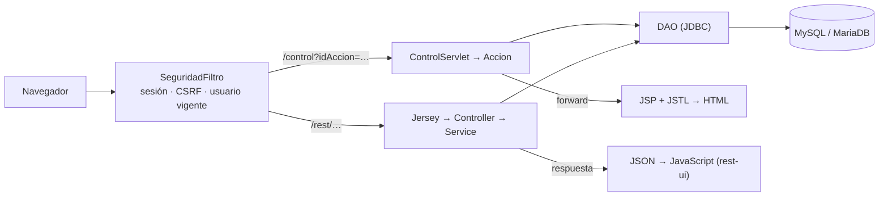

# Dos interfaces, un mismo núcleo

La aplicación ofrece dos formas de usar los mismos datos: una **interfaz web con JSP** (patrón Front Controller) y una **API REST en JSON**. No son alternativas excluyentes ni hay que activar una: conviven en el mismo WAR, y cada petición entra por la ruta que corresponda a lo que se pide.

## Qué cambia y qué se comparte

| | Interfaz JSP | API REST |
|---|---|---|
| **Entrada** | `/control?idAccion=…` | `/rest/titulacion`, `/rest/profesor`, `/rest/asignatura` |
| **Vista** | El servidor genera el HTML con JSP | El servidor devuelve JSON; el navegador lo pinta con JavaScript |
| **Controlador** | `ControlServlet` y una `Accion` por operación | Un `Controller` de Jersey por recurso |
| **Reglas de negocio** | En las acciones | En los `Service` |
| **Verbos** | `GET` para mostrar, `POST` para modificar | `GET`, `POST`, `PUT`, `DELETE` según la operación |
| **Errores** | Mensaje en la propia página | Código HTTP y `{"resultado": mensaje}` |
| **Se comparten** | Filtro de seguridad, DAO, beans, pool JNDI y base de datos | |

Lo que se crea por una vía se ve al instante en la otra, porque ambas acaban en los mismos DAO.

## Cuándo usar cada una

- **Interfaz JSP:** trabajo diario completo, incluidos alumnos, matrículas, exportación a CSV y gestión de usuarios.
- **API REST:** integración con otros programas o pantallas que prefieran consumir datos, y base para una interfaz que se actualice sin recargar la página. Cubre titulaciones, profesores y asignaturas; alumnos, matrículas y usuarios quedan solo en la interfaz JSP.

## Decisiones de diseño

- **Un único núcleo de datos.** Los controllers REST llaman a los mismos DAO que las acciones, así que no hay una segunda capa de persistencia que mantener ni datos que puedan divergir.
- **Lógica en capas.** En REST la lógica vive en el `Service`, que no conoce HTTP ni JSON. El `Controller` solo traduce y el `ErrorMapper` convierte cualquier error en una respuesta JSON coherente, sin detalles internos.
- **Una sola política de seguridad.** El mismo `SeguridadFiltro` protege las dos entradas. Sin sesión la API responde 401, toda escritura exige el token CSRF en la cabecera `X-CSRF-Token` y el usuario se revalida en cada llamada. Los detalles están en [rest.md](rest.md#seguridad).
- **Lectura estricta del JSON.** `org.json` convierte tipos en silencio (`"30"` en 30, `2.9` en 2); aquí un tipo equivocado es un 400 con su mensaje.
- **Reglas duplicadas a propósito.** Los servicios REST no llaman a las acciones, porque estas devuelven vistas. Si cambia una regla de asignaturas o titulaciones, hay que cambiarla en los dos sitios.
