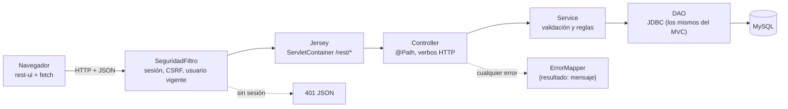

# Servicio REST

Además de la interfaz web con JSP, la aplicación expone una **API REST en JSON** sobre los mismos datos. La interfaz clásica genera HTML en el servidor (Front Controller + JSP) y la API devuelve solo datos, que un cliente consume con JavaScript. La comparación completa está en [mvc-y-rest.md](mvc-y-rest.md). Ambas comparten los DAO, los beans, el pool de conexiones y las reglas de negocio, así que lo que se crea por una vía se ve al instante en la otra.

## Arquitectura



| Capa (`gestion.rest`) | Responsabilidad | Lo que no hace |
|---|---|---|
| `controller` | Traduce HTTP y JSON: verbo, ruta, cuerpo. Un controller por entidad | No tiene lógica de negocio ni SQL |
| `service` | Valida y aplica las reglas de negocio; lanza `ApiException` con el código HTTP | No conoce HTTP ni JSON |
| `exception` | `ApiException` y sus subclases (`BadRequest` 400, `NotFound` 404, `Conflict` 409) | |
| `util` | `ParserObject` (bean ↔ JSON), `RestUtils` (leer el cuerpo, respuestas) y `ErrorMapper` | |
| `gestion.modelo` | Los DAO de siempre | No valida |

Jersey se registra en `web.xml` para `/rest/*` y descubre las clases `@Path` del paquete `gestion.rest`. Los controllers solo declaran `throws ApiException`: el `ErrorMapper` convierte cualquier excepción en `{"resultado": "mensaje"}` con su código, de forma que el cliente nunca recibe una página HTML de error ni un detalle interno (SQL, rutas). Los errores 500 dejan el detalle en el log del servidor.

## Conceptos REST aplicados

- **Recursos con URL:** `/rest/titulacion`, `/rest/profesor`, `/rest/asignatura`; un elemento concreto se identifica por su `id`.
- **Verbos HTTP como CRUD:** `GET` lee, `POST` crea (sin `id`), `PUT` modifica (con `id`) y `DELETE` borra.
- **Códigos de estado:** 200 correcto; 400 petición inválida; 401 sin sesión; 403 token CSRF ausente o inválido; 404 no existe; 405 verbo no permitido; 409 conflicto con una regla de negocio; 413 cuerpo demasiado grande; 415 no es `application/json`; 500 error interno.
- **Sin estado en el servidor:** cada petición lleva su propia identificación (la cookie de sesión y, al escribir, el token CSRF); el servicio no guarda nada entre llamadas.

## Seguridad

`SeguridadFiltro` intercepta también `/rest/*` y le aplica las mismas garantías que al resto de la aplicación.

- **Sin sesión, 401.** La API responde `{"resultado": "Sesión no iniciada"}` en lugar de redirigir al login. Las páginas del cliente (`/rest-ui/*`) sí redirigen.
- **Token CSRF en cabecera.** Toda petición que no sea `GET`, `HEAD` u `OPTIONS` debe llevar `X-CSRF-Token` con el token de la sesión; sin él, 403. El cliente lo lee de una etiqueta `<meta name="csrf-token">` que pinta el JSP.
- **Usuario vigente en cada petición.** Como en el MVC, el filtro relee el usuario en la base de datos: si se borra la cuenta, la API deja de responderle al instante. Si la base de datos falla en ese momento, la API responde un 500 en JSON, no una página de error.
- **Permisos.** Igual que en la interfaz clásica, cualquier usuario con sesión puede gestionar titulaciones, profesores y asignaturas; la gestión de usuarios (solo `admin`) no está expuesta por REST.
- **Cuerpo limitado y validado.** Máximo 64 KB, solo `application/json`, longitudes de texto según la base de datos (200 caracteres en los nombres y 10.000 en la descripción) y lectura estricta de tipos: un entero debe ser un entero de verdad (`"30"`, `2.9` o `4294967297` son un 400, no se convierten en silencio) y un texto debe ser un texto.
- **Sin caché.** Las respuestas llevan `Cache-Control: no-store`.
- **Salida segura en el cliente.** El texto que llega del servidor se inserta con `textContent`, nunca como HTML.
- **Rutas.** El filtro decide por `getServletPath()`, que no incluye los parámetros de ruta (`;x`), para que no se pueda esquivar con `/rest;.css`.

## Reglas de negocio

Son las mismas que en la interfaz web:

- No se puede eliminar una titulación con asignaturas (409).
- Una asignatura exige una titulación existente; el profesor, si se indica, también (404).
- No se puede bajar la capacidad de una asignatura por debajo de los alumnos matriculados (409) ni eliminarla si tiene alumnos (409).
- Eliminar un profesor desvincula antes sus asignaturas, en una transacción JDBC.
- Los nombres son obligatorios y de hasta 200 caracteres.

## Endpoints

Todos devuelven JSON. Las claves de respuesta son `titulacion(es)`, `profesor(es)` y `asignatura(s)`; los borrados devuelven `{"resultado": "…"}`.

### Titulaciones — `/rest/titulacion`

| Verbo | Ruta | Cuerpo | Respuesta |
|---|---|---|---|
| GET | `/rest/titulacion/listado` | — | `{ titulaciones: [...] }` |
| GET | `/rest/titulacion/datos/{id}` | — | `{ titulacion: {...} }` |
| POST | `/rest/titulacion` | `{ nombre, descripcion? }` | `{ titulacion: {...} }` |
| PUT | `/rest/titulacion` | `{ id, nombre, descripcion? }` | `{ titulacion: {...} }` |
| DELETE | `/rest/titulacion/{id}` | — | `{ resultado }` |

### Profesores — `/rest/profesor`

| Verbo | Ruta | Cuerpo | Respuesta |
|---|---|---|---|
| GET | `/rest/profesor/listado` | — | `{ profesores: [...] }` |
| GET | `/rest/profesor/datos/{id}` | — | `{ profesor: {...} }` |
| POST | `/rest/profesor` | `{ nombre, email? }` | `{ profesor: {...} }` |
| PUT | `/rest/profesor` | `{ id, nombre, email? }` | `{ profesor: {...} }` |
| DELETE | `/rest/profesor/{id}` | — | `{ resultado }` |

### Asignaturas — `/rest/asignatura`

| Verbo | Ruta | Cuerpo | Respuesta |
|---|---|---|---|
| GET | `/rest/asignatura/listado` | — | `{ asignaturas: [...] }` (con `nombreTitulacion` y `nombreProfesor`) |
| GET | `/rest/asignatura/datos/{id}` | — | `{ asignatura: {...} }` |
| POST | `/rest/asignatura` | `{ nombre, capacidadMaxima, idTitulacion, idProfesor? }` | `{ asignatura: {...} }` |
| PUT | `/rest/asignatura` | igual que el alta, más `id` | `{ asignatura: {...} }` |
| PUT | `/rest/asignatura/asignarProfesor` | `{ idAsignatura, idProfesor }` (`null` = quitar) | `{ asignatura: {...} }` |
| DELETE | `/rest/asignatura/{id}` | — | `{ resultado }` |

### Ejemplo

```js
// Las escrituras llevan el token de la sesión; la cookie de sesión viaja sola.
fetch('/GestionUniversitaria/rest/titulacion', {
    method: 'POST',
    headers: { 'Content-Type': 'application/json', 'X-CSRF-Token': token },
    body: JSON.stringify({ nombre: 'Física', descripcion: null })
}).then(r => r.json());   // { titulacion: { id: 4, nombre: 'Física', descripcion: null } }
```

## Cliente incluido

Las pantallas de `src/main/webapp/rest-ui/` (enlace **API REST** en el menú) consumen el servicio con `fetch`: `titulacion.jsp`, `profesor.jsp` y `asignatura.jsp`, con sus listados, altas, ediciones y borrados sin recargar la página. `rest.js` reúne lo común (llamadas con token, mensajes y filas de tabla) y las pantallas usan la misma hoja de estilos que el resto de la aplicación.

## Cómo ampliarlo

Para una entidad nueva, seguir el mismo patrón: un `Controller` con `@Path`, un `Service` con sus reglas, y las conversiones en `ParserObject`. No hay que tocar `web.xml` (Jersey escanea el paquete), ni el filtro, ni el `ErrorMapper`.
